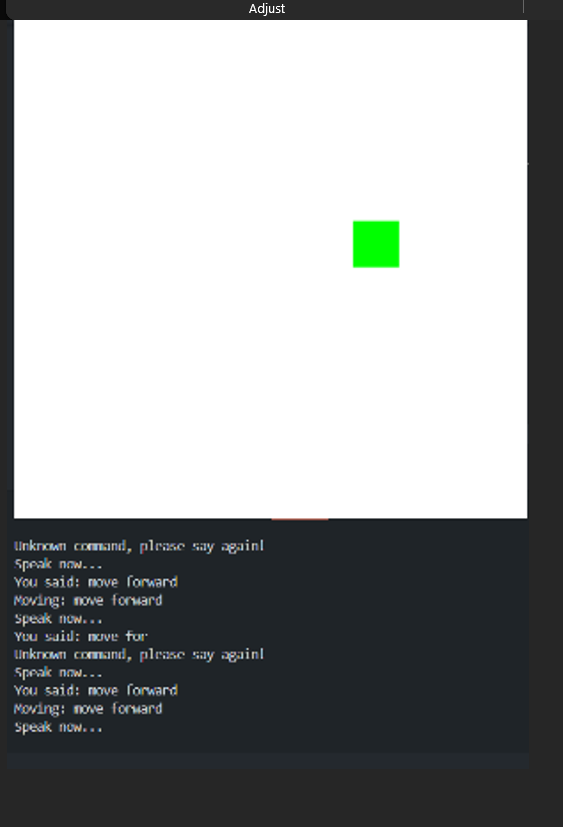
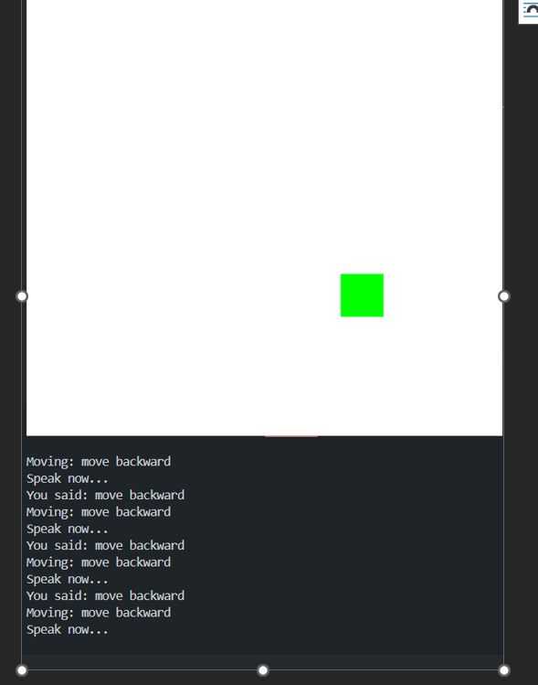
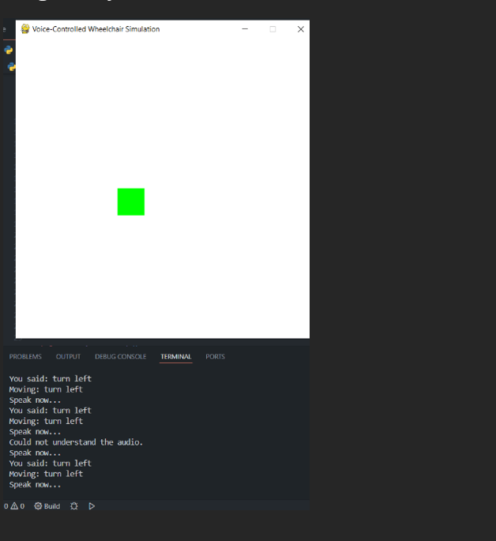
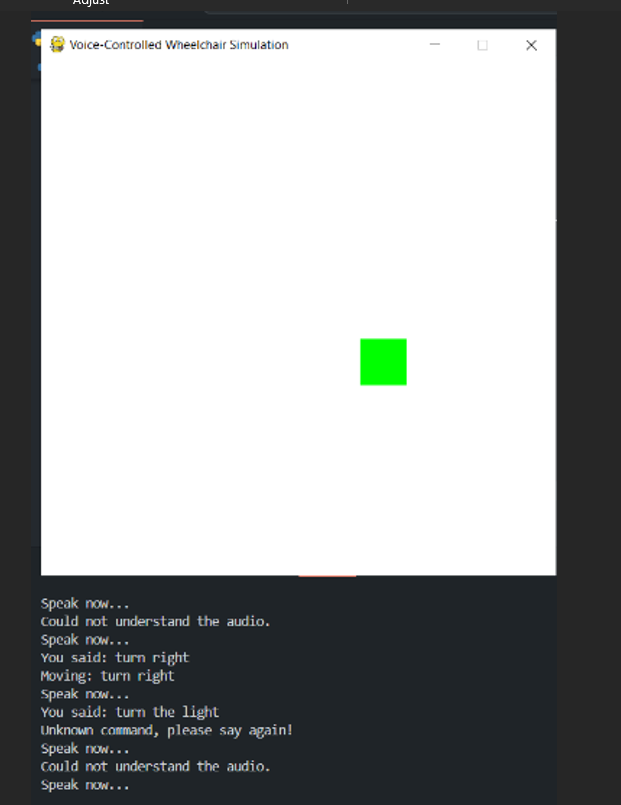

🎙️ Voice-Controlled Smart Wheelchair using Edge AI & TensorFlow Lite
🚀 Overview

This project presents an end-to-end speech recognition pipeline for a voice-operated smart wheelchair simulation. The system recognizes five navigation commands using a trained neural network model and controls a virtual wheelchair in real time.

The model was developed using Edge Impulse and deployed as a quantized TensorFlow Lite (int8) model optimized for low-latency edge inference (~20ms).

This project demonstrates:

Dataset collection & labeling

MFCC-based audio preprocessing

Neural network training & evaluation

Model quantization & edge deployment

Real-time inference integration in Python

Simulation control using PyGame

🎯 Supported Voice Commands

Move Forward

Move Backward

Turn Left

Turn Right

Stop

📊 Dataset Details

Total Samples: 1,478

Total Audio Duration: 26 minutes 18 seconds

Sampling Rate: 16 kHz

Sample Length: 1 second

Classes: 5

Train/Test Split: 80/20

Why 16kHz?

16kHz is a standard sampling rate for speech recognition systems. It preserves essential speech frequency components (up to 8kHz) while reducing computational complexity compared to 44.1kHz audio.

🧠 Feature Extraction
MFCC (Mel-Frequency Cepstral Coefficients)

Number of coefficients: 40

Window size: ~30ms

Frame overlap applied

Converts time-domain audio into frequency-domain features

Mimics human auditory perception

Reduces dimensionality while preserving speech-relevant information

MFCC was chosen instead of raw waveform input to improve classification performance and reduce model complexity.

🏗 Model Architecture

Model Type: Fully Connected Neural Network

Input: MFCC feature vector

Output Layer: Softmax (5 classes)

Deployment Format: Quantized TensorFlow Lite (int8)

Why Fully Connected Instead of CNN?

A fully connected network was selected due to:

Small dataset size (1,478 samples)

Lower computational requirements

Faster training and inference

Suitability for edge deployment

CNN-based architectures can improve robustness but require larger datasets and higher compute resources.

📈 Model Performance
Metric	Value
Validation Accuracy	89.4%
Test Accuracy	78.2%
Inference Latency	20 ms
Peak RAM Usage	19.8 KB
Flash Usage	33.9 KB
Quantization	int8
Performance Analysis

The validation-test accuracy gap indicates minor overfitting due to:

Limited dataset diversity

Environmental noise variations

Similar-sounding commands

Future improvements include noise augmentation and dataset expansion to improve generalization.

⚡ Edge Deployment Details

Platform: TensorFlow Lite

Quantized Model: int8

Real-time inference latency: ~20ms

Optimized for microcontroller-based systems

The model is lightweight and suitable for real-world assistive technology deployment.

🔄 Real-Time Simulation Pipeline

Audio captured using PyAudio

Audio converted into MFCC features

Features passed into TFLite interpreter

Model predicts command

PyGame updates wheelchair movement

Unknown or unclear commands handled gracefully

🖥️ Simulation Screenshots
🔹 Move Forward Detection

Model correctly recognizes the command and updates movement in real time.

🔹 Move Backward Detection

Demonstrates stable inference and command execution.

🔹 Turn Left Recognition

Correct directional control based on voice input.

🔹 Turn Right Recognition

Low-latency response during real-time simulation.

🔗 Live Edge Impulse Project

Full training pipeline, dataset configuration, and deployment details:

👉 https://studio.edgeimpulse.com/public/657394/live

🛠 Tech Stack

Python

Edge Impulse

TensorFlow Lite

PyAudio

PyGame

NumPy / SciPy

🔮 Future Improvements

CNN-based speech classification

Noise augmentation for better generalization

Hardware integration (microcontroller + motor control)

Multi-language support

Adaptive user-specific voice tuning

👨‍💻 Author

Piyush Saini
MCA | AI/ML Enthusiast | Edge AI Developer
